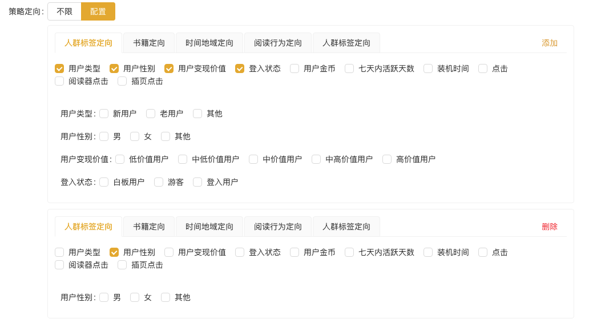

# 定向

## 目录位置
`apps/ad.qmniu.com/src/components/operation-module/scope`
`apps/ad.qmniu.com/src/components/directional/policy-target.vue`
`apps/ad.qmniu.com/src/components/directional/device-scope.vue`

## 展示

<script setup> 
    import PolicyTarget from '@components/ad.qmniu.com/directional/policy-target.vue'
    import {reactive} from 'vue';

    const data = reactive({
        visible: false,
        values: {
            common: {
                data: {
                    "id": 2870,
                    "sort": 0,
                    "name": "",
                    "data": [
                        {
                            "top_category": "user_tag_direction",
                            "sub_category": {
                                "user_tag_direction": [
                                    "t_mode",
                                    "last_3_days_duration"
                                ]
                            },
                            "sub_category_other": [
                                "t_mode",
                                "last_3_days_duration"
                            ],
                            "direction_detail": {
                                "t_mode": [0],
                                "last_3_days_duration": [5]
                            }
                        }
                    ]
                }
            }
        },
        type: 'common.data',
        isDisabled: true
    }) 
</script>

<codeView title="基本用法" description="自定义维度用法">
    <policy-target :visible="data.visible" :values="data.values" :type="data.type" :isDisabled="data.isDisabled"></policy-target>
    <template #codeText>
        <highlight-code :code="code" >
        </highlight-code>
    </template>
</codeView>

## 功能实现

### 配置文件介绍
> 通过`schemas`配置, 方便后期维护 
 
`apps/ad.qmniu.com/src/enums/scope/device.ts` 为设备范围的配置项   
`apps/ad.qmniu.com/src/enums/scope/policy` 为策略定向的配置项   
`apps/ad.qmniu.com/src/views/operation-module/policy-management/components/meta/enums/modules-enums.ts` 是组件的枚举集合体, 方便按需展示, 以及后期维护  
`apps/ad.qmniu.com/src/views/operation-module/policy-management/components/meta/hooks/use-values-set.ts` 是子父组件数据交流hooks, 提出, 方便公用

### 复杂逻辑

#### 设备范围/策略定向 逻辑

> **后续如增加设备范围 以及定向, 只用维护 `device.ts` and `policy.ts`, 配置schemas, 即可实现**

```js
// 配置文件 device.ts
export interface IScopeSchames{
    component: 'AInput' | 'ASelect' | 'custom' | 'ARadioGroup' | 'ATimeRangePicker' | 'AButton' | 'ACascader' | 'ACheckboxGroup',
    componentProps?: Record<string, any>
    label?: string
    field: string
}

// 最外边一层, 对应 tab
const deviceScope = [
    {label: '设备类型', value: 'deviceTypeEnums'}
];

// 第二层的单个枚举, 设备类型
const deviceTypeEnums = [
    {label: '渠道', value: 'channel'},
    {label: '厂商', value: 'brand'},
    {label: '设备号', value: 'device'}
];

// 第二层的所有枚举集合
const subDeviceScopeEnums: Record<'deviceTypeEnums', ISelectOption[]> = {
    deviceTypeEnums
};

// 第三层的单个枚举, 设备类型
const detailDeviceTypeEnums: Record<string, IScopeSchames[]> = {
    'channel': [{
        component: 'ASelect', field: 'channel_radio', label: '渠道',
        componentProps: {options: [{label: '白名单', value: '1'}, {label: '黑名单', value: '2'}], class: 'w-200'}
    }, {
        component: 'AInput', field: 'channel',
        componentProps: {class: 'w-300'}
    } ],
    'brand': [{
        component: 'ASelect', field: 'brand_radio', label: '厂商',
        componentProps: {options: [{label: '白名单', value: '1'}, {label: '黑名单', value: '2'}], class: 'w-200'}
    }, {
        component: 'AInput', field: 'brand',
        componentProps: {class: 'w-300'}
    } ],
    'device': [{
        component: 'AInput', field: 'device', label: '设备号'
    }]
};

// 第三层的所有枚举
const triDeviceScopeEnums: any = {
    deviceTypeEnums: detailDeviceTypeEnums
};

export {
    deviceScope,
    triDeviceScopeEnums,
    subDeviceScopeEnums
};
```

```html
 <!-- device-scope.vue  -->
<template #direction="{model, field}">
    <a-card class="qm-card" :size="data.size" :class="index? 'mt': ''" v-for="(group, index) in model[field]" :key="index">
        <a-tabs :size="data.size" v-model:activeKey="group.top_category" type="card">
            <template #rightExtra>
                <a-button v-if="index === 0" type="link" @click="add_group(model, field)">添加 </a-button>
                <a-button v-else class="font-red" type="link" @click="del_group(model, field, index)">删除 </a-button>
            </template>
            <a-tab-pane v-for="(tab) in policyTarget" :key="tab.value" :tab="tab.label">
                <a-form-item>
                    <a-checkbox-group v-model:value="group.sub_category[tab.value]" :options="PolicyTargetEnums[group.top_category]" @change="(e: string[]) => add_detail(group,e)"></a-checkbox-group>
                </a-form-item>
                <div class="m-t-30" >
                    <template v-for="triKey in group.sub_category[tab.value]" :key="triKey">
                        <template v-if="data.triPolicyTargeteEnums[triKey]">
                            <div class="qm-flex">
                                <!-- 如果schema长度为1 -->
                                <template v-if="data.triPolicyTargeteEnums[triKey].length === 1">
                                    <a-form-item class='ml' :label="data.triPolicyTargeteEnums[triKey][0].label">
                                        <template v-if="data.triPolicyTargeteEnums[triKey][0].component !== 'custom'">
                                            <component :is="data.triPolicyTargeteEnums[triKey][0].component" v-model:value="group.direction_detail[data.triPolicyTargeteEnums[triKey][0].field]" v-bind="{class:'w-200', ...data.triPolicyTargeteEnums[triKey][0].componentProps}"></component>
                                        </template>
                                    </a-form-item>
                                </template>
                                <!-- 如果schema长度大于1 -->
                                <template v-else>
                                    <template v-for="schema in data.triPolicyTargeteEnums[triKey]" :key="schema.field">
                                        <a-form-item class='ml' :label="schema.label">
                                            <template v-if="schema.component !== 'custom'">
                                                <component :is="schema.component" v-model:value="group.direction_detail[triKey][schema.field]" v-bind="{class:'w-200', ...schema.componentProps}"></component>
                                            </template>
                                        </a-form-item>
                                    </template>
                                </template>
                            </div>
                        </template>
                    </template>
                </div>
            </a-tab-pane>
        </a-tabs>
    </a-card>
</template>

``` 
效果展示




