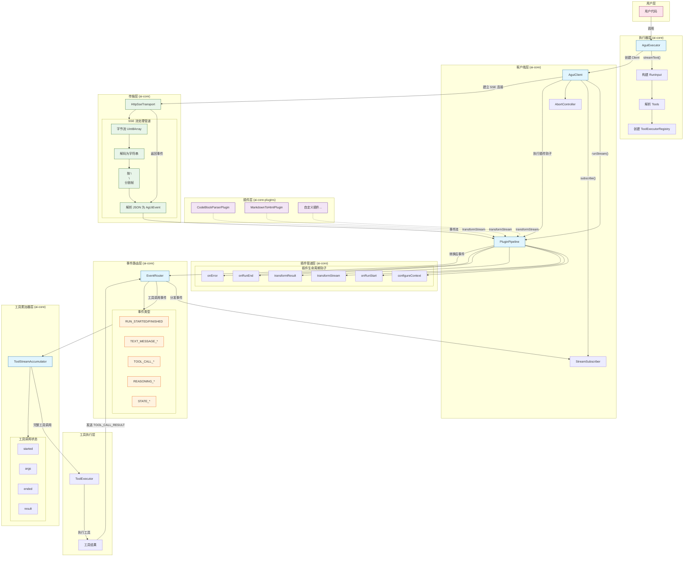
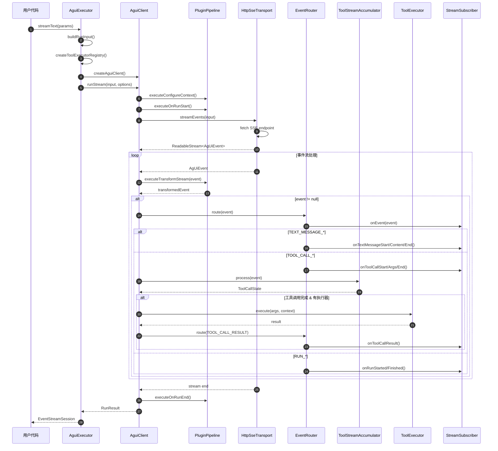

# ai-core 架构文档

## 整体架构图



## 调用时序图



## 核心模块分层

| 层级             | 模块                    | 文件                            | 职责                                        |
| ---------------- | ----------------------- | ------------------------------- | ------------------------------------------- |
| **执行器层**     | `AguiExecutor`          | `runtime/executor.ts`           | 高层 API 封装，构建运行输入，管理工具注册表 |
| **客户端层**     | `AguiClient`            | `runtime/client.ts`             | 核心协调器，管理订阅、中止信号、运行会话    |
| **插件管道层**   | `PluginPipeline`        | `plugins/pipeline.ts`           | 插件生命周期管理，事件/参数转换             |
| **传输层**       | `HttpSseTransport`      | `transport/httpSseTransport.ts` | SSE 连接管理，字节流→事件流转换             |
| **事件路由层**   | `EventRouter`           | `runtime/eventRouter.ts`        | 事件分发，通知订阅者                        |
| **工具累加器层** | `ToolStreamAccumulator` | `runtime/toolStream.ts`         | 累积工具调用参数，管理工具状态机            |

## 关键调用链

```
用户代码
  → AguiExecutor.streamText()
    → AguiClient.runStream()
      → PluginPipeline (钩子执行)
        → HttpSseTransport (SSE 流)
          → PluginPipeline.transformStream (事件转换)
            → EventRouter.route() (事件分发)
              → StreamSubscriber (用户回调)
              → ToolStreamAccumulator (工具状态累积)
                → ToolExecutor (工具执行)
```

## 模块详解

### 1. AguiExecutor（执行器）

**文件**: `runtime/executor.ts`

**职责**:

- 提供高层 API：`streamText()` 和 `generateText()`
- 构建 `RunInput` 对象
- 管理工具注册表 (`ToolExecutorRegistry`)
- 实现异步事件队列，支持 `for await...of` 迭代

**核心方法**:

```typescript
streamText(params: StreamTextParams, options?: ExecutorRunOptions): EventStreamSession
generateText(params: GenerateTextParams, options?: ExecutorRunOptions): Promise<GenerateTextResult>
```

### 2. AguiClient（客户端）

**文件**: `runtime/client.ts`

**职责**:

- 核心协调器，串联所有模块
- 管理订阅者 (`StreamSubscriber`)
- 处理中止信号 (`AbortController`)
- 协调插件管道、传输层、事件路由
- 实现工具调用循环（多轮对话）

**核心方法**:

```typescript
subscribe(subscriber: StreamSubscriber): { unsubscribe: () => void }
abort(runId: string): void
runStream(input: AgUiRunInput, options?: RunStreamOptions): RunSession
```

### 3. PluginPipeline（插件管道）

**文件**: `plugins/pipeline.ts`

**职责**:

- 管理插件生命周期
- 按顺序执行插件钩子：`pre → normal → post`
- 提供事件/参数转换能力

**插件钩子**: | 钩子 | 执行时机 | 用途 | |------|----------|------| | `configureContext` | 运行开始前 | 配置上下文 | | `onRunStart` | 运行开始时 | 初始化操作 | | `transformStream` | 每个事件 | 转换/过滤事件 | | `transformResult` | 运行结束时 | 转换结果 | | `onRunEnd` | 运行结束后 | 清理操作 | | `onError` | 发生错误时 | 错误处理 |

### 4. HttpSseTransport（传输层）

**文件**: `transport/httpSseTransport.ts`

**职责**:

- 建立 SSE 连接
- 处理字节流到事件流的转换

**流处理管道**:

```
Uint8Array → TextDecoder → string
  → 按 \n\n 分割 → SSE 帧
  → 解析 JSON → AgUiEvent
```

### 5. EventRouter（事件路由）

**文件**: `runtime/eventRouter.ts`

**职责**:

- 分发事件到所有订阅者
- 根据事件类型调用对应的回调方法

**支持的事件类型**:

- `RUN_STARTED` / `RUN_FINISHED` / `RUN_ERROR`
- `TEXT_MESSAGE_START` / `TEXT_MESSAGE_CONTENT` / `TEXT_MESSAGE_END`
- `TOOL_CALL_START` / `TOOL_CALL_ARGS` / `TOOL_CALL_END` / `TOOL_CALL_RESULT`
- `REASONING_START` / `REASONING_END` / `REASONING_MESSAGE_*`
- `STATE_SNAPSHOT` / `STATE_DELTA`

### 6. ToolStreamAccumulator（工具累加器）

**文件**: `runtime/toolStream.ts`

**职责**:

- 累积工具调用的流式参数
- 管理工具调用状态机

**状态机**:

```
started → args → ended → result
```

**核心方法**:

```typescript
process(event: AgUiEvent): ToolCallAccumulatorState | null
```

## 事件类型

所有事件类型定义在 `constant.ts` 和 `types.ts` 中：

| 类别             | 事件                                                                                        | 说明               |
| ---------------- | ------------------------------------------------------------------------------------------- | ------------------ |
| **运行生命周期** | `RUN_STARTED`, `RUN_FINISHED`, `RUN_ERROR`                                                  | 运行开始/完成/错误 |
| **文本消息**     | `TEXT_MESSAGE_START`, `TEXT_MESSAGE_CONTENT`, `TEXT_MESSAGE_END`, `TEXT_MESSAGE_CHUNK`      | 文本消息流         |
| **工具调用**     | `TOOL_CALL_START`, `TOOL_CALL_ARGS`, `TOOL_CALL_END`, `TOOL_CALL_CHUNK`, `TOOL_CALL_RESULT` | 工具调用流         |
| **推理**         | `REASONING_START`, `REASONING_END`, `REASONING_MESSAGE_*`                                   | 推理过程           |
| **状态管理**     | `STATE_SNAPSHOT`, `STATE_DELTA`, `MESSAGES_SNAPSHOT`                                        | 状态同步           |
| **原始/自定义**  | `RAW`, `CUSTOM`                                                                             | 扩展事件           |

## 插件系统

### 内置插件（ai-core-plugins）

| 插件                    | 文件                       | 功能                                 |
| ----------------------- | -------------------------- | ------------------------------------ |
| `CodeBlockParserPlugin` | `codeBlockParserPlugin.ts` | 解析 Markdown 代码块，提取结构化数据 |
| `MarkdownToHtmlPlugin`  | `markdownToHtmlPlugin.ts`  | 将 Markdown 转换为 HTML 和结构化块   |

### 自定义插件

```typescript
interface AguiPlugin {
    name: string;
    enforce?: 'pre' | 'post'; // 执行顺序
    configureContext?: (context: AguiPluginContext) => Promise<void>;
    onRunStart?: (context: AguiPluginContext) => Promise<void>;
    transformStream?: (event: AgUiEvent, context: AguiPluginContext) => Promise<AgUiEvent | null>;
    transformResult?: (result: RunResult, context: AguiPluginContext) => Promise<RunResult>;
    onRunEnd?: (context: AguiPluginContext, result: RunResult) => Promise<void>;
    onError?: (error: Error, context: AguiPluginContext) => Promise<void>;
}
```

## 目录结构

```
ai-core/
├── src/
│   ├── index.ts              # 导出入口
│   ├── constant.ts           # 事件类型常量
│   ├── types.ts              # 类型定义
│   ├── runtime/
│   │   ├── client.ts         # AguiClient 客户端
│   │   ├── executor.ts       # AguiExecutor 执行器
│   │   ├── eventRouter.ts    # 事件路由
│   │   └── toolStream.ts     # 工具流累加器
│   ├── plugins/
│   │   └── pipeline.ts       # 插件管道
│   ├── transport/
│   │   └── httpSseTransport.ts  # HTTP SSE 传输
│   └── __tests__/            # 测试文件
├── package.json
├── tsconfig.json
└── README.md
```

## 设计原则

1. **分层架构**: 清晰的职责分离，每层只关注自己的核心功能
2. **插件化**: 通过插件管道实现可扩展性
3. **流式处理**: 全链路流式设计，支持大模型流式响应
4. **可中断**: 使用 `AbortController` 支持运行时中断
5. **类型安全**: 完整的 TypeScript 类型定义
